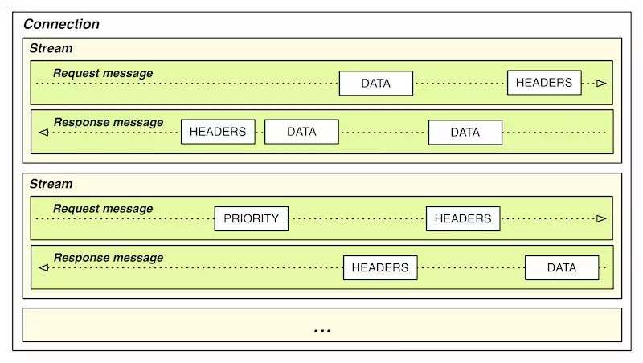

# HTTP/2 概览

## 基本概念

- 帧（Frame）：HTTP/2 数据通信的最小单位。帧用来承载特定类型的数据，如 HTTP 首部、负荷；或者用来实现特定功能，例如打开、关闭流。每个帧都包含帧首部，其中会标识出当前帧所属的流
- 消息（Message）：指 HTTP/2 中逻辑上的 HTTP 消息。例如请求和响应等，消息由一个或多个帧组成
- 流（Stream）：存在于连接中的一个虚拟通道。流可以承载双向消息，每个流都有一个唯一的整数 ID
- 连接（Connection）：与 HTTP/1 相同，都是指对应的 TCP 连接

## 相对于 HTTP/1.1

- 多路复用 - Multiplexing
- 二进制分帧 - Binary Framing Layer
- 首部压缩 - Header Compression
- 服务端推送 - Server Push

## 深入阅读

- [HTTP/1.1 vs HTTP/2: What's the Difference?](https://www.digitalocean.com/community/tutorials/http-1-1-vs-http-2-what-s-the-difference)
